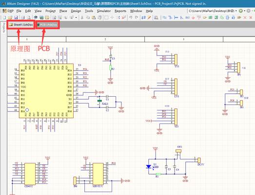

# 交互式语音家居控制系统的设计

 

摘    要

 

随着华为公司拿下5G控制信道eMBB场景编码方案，物联网的普及也距我们的生活越来越近，物联网已成为时下研究热门领域。而物联网最早的应用是在智能家居方面。在手机领域，苹果siri的出现颠覆人们对手机的概念，从键盘机到触屏机再到现在的语音交互。本文介绍的便是一种新型的语音交互式智能家居解决方案，它融合了语音交互和智能家居两个领域的特点，给人们一种全新的体验。是未来智能家居发展的一个重要方向。本设计使用STC公司增强型12单片机作为主控制器，使用了语音识别、MP3播放、时钟、蓝牙、LCD显示屏、继电器等模块，实现了人机对话、无线控制、手机控制、语音报时、时间温度显示、闹钟等功能。充分体现了各个模块之间的相互协作，外观精美，操作方便，市场前景广阔，具有很大的研发意义。

 

关键词    单片机/智能家居/无线控制/语音交互

 

**DESIGN OF VOICE INTERACTIVE** 

**HOME CONTROL SYSTEM**

 

**ABSTRACT**

 

 

With the Huawei won the 5G control channel eMBB scene encoding scheme, the popularity of Internet of things is also closer to our lives, Internet of Things has become a hot research field nowadays. The Internet of things is the first application in the smart home. In the field of mobile phones, Apple’s siri subversion of the emergence of the concept of mobile phones, from the keyboard to the touch screen machine to the current voice interaction. This article describes a new type of voice interactive smart home solutions, which combines the two areas of voice interaction and intelligent home features, giving people a new experience. Is the future of intelligent home development is an important direction. The design uses STC Enhanced 12 single-chip as the main controller, using the voice recognition, MP3, clock, Bluetooth, LCD screen, relays and other modules to achieve human-computer dialogue, wireless control, mobile control, voice timekeeping, time Temperature display, alarm clock and other functions. Fully embodies the mutual cooperation between the various modules, the appearance of fine, easy to operate, the market prospect is broad, has great significance for research and development.

 

**KEY WORDS**  MCU,voice interactive,smart home,wireless control

目    录

[TOC]

# 1         绪论

## 1.1      研究现状与发展趋势

伴着5G通讯技术的进步，物联网进入千家万户已经近在咫尺。智能家居作为物联网产品的代表现在已经变得炙手可热,本设计的灵感来自于智能手机的语音助手和智能家居的结合，借助语音识别技术来实现人机交互，通过物联网技术进而控制家用电器，大大的简化了传统的用电器控制方式，在很大程度上方便了人们的生活。

近年来，以磁卡门禁、红外遥控、智能插座、环境检测等为象征的“智能产品”在电商业务渠道和公共销售平台中的大量涌现，很大程度上降低了用户使用智能家居产品的门坎。伴着操控技术和互动方式的不断进步，[智能化家居](http://smarthome.ofweek.com/)控制方式也涌现出多纬度发展的态势。在各种智能产品迭代的过程当中，APP的适配成为智能化的一个不可或缺的元素，也开始被众多终端用户认可和接受。另外，在各个领域应用成熟的传感器技术和新兴的云语音识别技术相结合，成为了无需动手的新一代控制交互方式。尤其是对于老年和儿童使用者，在操控体验舒适度方面有着不可比拟的优势。

## 1.2      研究背景和设计目的

当前的语音提示类产品种类繁多，但大都是单方向的，如电动车语音提示，充电器语音提示等由设备直接播放设置好的语音，并不能实现人机对话的效果。在物联网即将盛行的当下，出现了各种新颖的操控方式。语音交互的操作方式作为其中的一个分支，具有巨大的成长潜力。

毕业设计作为查验在本科阶段学习成果和知识技能的一种方式，是完善和增强本科学习阶段的最后一步。选择这个题目，一方面是为了检验所学知识漏洞巩固所学内容，另一方面为了提高个人就业竞争力。语音交互式家居控制系统为以后的IOT的成长贡献了新的思路。

# 2         总体设计方案

## 2.1      设计要求

使用单片机为主控制器设计一套完整的家居控制系统，应具有如下功能：

a.主控制端与从控制端使用无线的方式传输数据指令；

b.当前时间和温度信息可以通过语音播放，掉电可走时；

c.可以进行简单人机对话，包括控制指令、诵读古诗、播放音乐等等；

d.主控制端可充电，重量轻体积小，外观美观；

e.可以通过语音对话的方式来控制用电器的开关；

f.从控制端可显示时间和温度信息，有闹钟功能。

 

## 2.2      总体方案

方案一：使用两个STM32作为主控制器，主从机各采用LD3320语音识别模块，DS1302时钟芯片，HC-05蓝牙模块，串口MP3播放模块，LCD触摸屏彩屏等实现相应的功能。优点是可配置方案多，效果理想，能较为完善的实现相应功能。缺点是系统庞大，开发难度大，研发周期长，价格高昂，稳定性不易控制。

方案二：使用增强型51单片机作为主控制器，主从机分别采用语音识别协处理模块，DS3231时钟模块、蓝牙模块、LCD1602屏部分、串口MP3播放部分、DS18B20温度传感器等模块实现相应的功能。优点是软硬件成熟，移植性强，价格合理易接受，硬件资源刚好满足系统要求，研发周期短，难度相对适中，后期维护简单。缺点是解密容易，内部资源刚好满足当前要求，后期扩展性不足。

方案三：使用Arduino UNO作为主控制器，Arduino Micro 作为从控制器,使用2.4G模块进行通信，加上语音识别模块、时钟芯片、MP3播放部分、温度检测传感器等模组来实现相应功能。此方案有点是硬件搭建简单，软件易编写调试，后期维护相对方便。缺点是Arduino模块价格高昂，Aduino定位于硬件积木、电子玩具；不适用于用来做稳定性要求很高的产品设计。

由于我对51单片机平台的周围器件、模块操作的使用比较熟悉，C语言基础好，综上所述，我选择了方案二作为本次设计的最后执行方案。

## 2.3      结构框图

总体设计分为两部分，第一部分是主控制端，也称可移动端，主要负责人机对话，语音报时，无线控制等功能，其原理框图如图所示。第二部分是从控制端，也称为固定端，主要负责时间温度显示，控制继电器开合，闹钟提醒等功能。主控制端通过蓝牙与从控制端通信，继而以语音的形式通过无线向从控制端发送指令，来实现控制用电器的功能，图2-1是主控制端的原理框图，图2-2是从控制端的原理框图。

 

图2-1                                                                   图2-2

 

# 3         硬件设计

## 3.1      主控制端

### 3.1.1     主控制器

本设计需要使用多个标准串口，内部程序空间大，处理速度快的处理器，因此选用了STC公司生产的12C5A60S2单片机。该处理器为增强型8051单时钟周期(1T)的单片机，具有两个串口，时钟频率0-35MHz，工作电压3.5-5.5V，ROM存储器60KB。在本设计中，主控部分为了减小电路体积，采用了贴片式LQFP-44封装，从控制部分采用双列直插DIP-40封装。为了使用标准串口通信，需要产生标准的波特率，故选用22.1184MHz的晶体振荡器。

### 3.1.2     MP3播放模块

图3-1 串口MP3播放模块引脚示意图

为了实现语音交互，需要可以播放录音的MP3播放器模块，选用了YX-5200串口通信的MP3播放器模块。YX-5200是一颗高保真MP3解码芯片，集成了MP3和WAV两种格式的解码，支持TF-CARD，只需要简单的串口指令即可完成控制，价格低，控制便捷，工作稳定，性价比高,图3-1是MP3模块的引脚示意图。

该模块的控制方式为异步串口通讯，使用9600bps波特率，串口控制指令如表1所示：

表1 语音识别模块串口控制指令

校验和的计算方法为：65536减数据位之和。其中Busy位是判忙标志位，在MP3播放器工作时，不能和外接进行通信，对外表现出BUSY位为低电平。MCU若要对其控制，必须等待标志位置高再发送指令。

### 3.1.3     蓝牙模块

无线通信选用一对蓝牙HC-05模块，使用前要首先进入AT模式，进行主从角色、波特率、绑定地址等配置。在按住模块的功能键后再上电，会自动进入AT指令模式，默认使用38400bps波特率，使用串口发送相应指令，对蓝牙名称、配对密码、绑定地址、工作模式进行配置。在本设计中，主控制端需配置为主工作模式，从控制端需要配置为从工作模式，工作波特率配置为9600bps，绑定地址需填写对方MAC地址,图3-2是蓝牙HC-05模块的原理图。

图3-2 蓝牙HC-05模块原理图

配置完成后直接连接到MCU控制器的TXD和RXD端口即可使用。模块之间的通信使用标准串口协议，波特率为9600bps，本模块主要用来实现语音指令对固定端的控制,控制指令如表2。

表2 蓝牙传输指令表

发送端和接收端只需要遵循这个协议即可完成互相通信，由于是近距离通信，信号质量较高，实际在室温10米距离的条件下进行测试，工作正常，极少产生误码现象，所以没有进行数据校验。

### 3.1.4     时钟模块

本设计需要选用一个低成本、高精度、有掉电走时功能、外设简单的低功耗实时时钟芯片。经过对比选择了Maxim公司生产的DS3231时钟芯片。该芯片价格低、精度高、具有温度补偿，通过I2C与外界通信，可外接纽扣电池，实现掉电走时功能,图3-3是DS3231芯片的标准硬件连接图。

图3-3 DS3231标准接线图

DS3231与单片机通信时采用标准I2C协议。控制信号分为开始信号和结束信号，在时钟线为高电平时，数据线上的下降沿为I2C开始信号，上升沿为I2C结束信号。在传输数据时，当时钟线为高电平，数据线上的电平必须保持不变化，否则会被当做是控制信号。在单片机与DS3231通信时，首先发送起始信号，再发送器件地址和读写位，然后数据传送开始，待数据传送完成后发送结束信号,IIC通信协议如图3-4所示。

图3-4 DS3231芯片IIC协议时序图

DS3231的IIC器件地址是1101000，在使用时，只需写入或者读取相应寄存器内的值即可。通过I2C协议使用非常便捷，在成库中添加IIC的库文件，然后主函数中调用即可实现读写寄存器的操作,表3是DS3231的常用寄存器配置。

表3  DS3231芯片常用寄存器

### 3.1.5     语音识别模块

为了实现人机对话，语音交互的功能，选用了语音识别协处理模块。该模块采用32位RISC内核协处理器，工作频率96MHz，内建96KbSRAM。可进行非特定人语音识别，可对用户的语音进行识别，支持中文音素识别，可任意指定中文识别词条(小于8个字)。采用标准UART接口与主控通信，采用三字节数据来传输语音识别命令和识别结果。模块使用标准串口19200波特率与单片机进行数据传输。

在单片机配置时流程如下：

a.上电，模块等待初始化命令。

b.发送模块初始化指令，等待模块回复数据，校验回传数据。如果30秒内无命令则自动进入休眠。

c.根据使用需求来设置麦克风的灵敏度。

d.按照需要配置噪声门限。

e.配置识别命令组。

f.启动单次识别，等待识别数据。

g.读取识别数据，执行对应处理，或者读取候选识别数据进行操作。

h.重复e-g或f-g步骤，实现语音互动。

i.退出识别。

j.进入低功耗模式。

常用命令如表4所示。

表4 语音识别模块常用指令

### 3.1.6     功放模块

功放模块使用D类立体声音频功放芯片PAM8403，相对于AB类功放来说，D类功放具有效率极高，体积小，可靠性高等优点。该模块无需无耦合电容和低通滤波电路即可直接输出到扬声器，可在5V电压输入和4ohm负载的条件下，输出3W的扬声器功率。D类功放又称为数字功放。把音频信号输入比较器的反相端，三角波信号输入比较器正向端，比较器的输出既为经过脉宽调制(PDM)的音频信号。把PDM信号放大为高电压大电流后，经过解调(通过低通滤波器)后即可驱动扬声器发声。图3-5为PAM8403的调制解调原理图，图3-6是PAM8403的典型应用电路。

    

图3-5     D类功放原理图                                图3-6 PAM8403典型应用电路图

 

### 3.1.7     电源模块

电源部分为一节18650锂电池和一个DC_DC升压电路组成。U1为锂电池端，U0为输出电压端，T1为一个MOS三极管作为开关三极管。当T1闭合时，输入电压流过电感，流经电感的电流以一定的斜率线性增加，这个斜率和电感的大小有密切关系。随着流经电感的电流不断增加，电感内部储存了一定的磁能。当T1断开时，由于电感上的电流不会跃变，而是由充磁完毕时候的电压缓慢的降为零，由于原来的电路已经断开，于是只能通过另一个回路进行放电，电感中储存的磁能转换为电流，电流对电容进行充电，电容充电后两端电压随之升高，此时输出电压已经高于输入电压。当开关管T1的开关频率足够高，C的容量足够大时，就可以在输出端Uo输出一个高于输入电压并且稳定持续的电流。DC_DC升压电路的基本原理如图3-7。

图3-7 Boost升压原理图                                  图3-8 串口复用逻辑图  

### 3.1.8     串口复用模块

由于主控制端需要通过标准串口与MP3语音播放模块、语音识别模块和蓝牙模块进行通信，但是单片机只有两个串口，所以需要采用串口复用。本设计选用了CD4052模拟开关进行复用，A和B是控制端，X和Y是输入端，通过A和B的不同取值，来改变接通的通道。在实际使用过程中，MP3语音播放模块使用通道4，蓝牙HC-05使用通道2。余下的通道1和通道3留空未使用,可以在以后功能更新时扩展更多的外设模块，图3-8是CD4052的功能逻辑图，表5是CD4052的真值表。

表5 CD4052的真值表

 

## 3.2      从控制端

### 3.2.1     继电器模块

继电器部分有四组光耦隔离继电器，在实际电路当中分别定义了台灯、电视、热水器、风扇这四个用电器。每组各有一个DP817光耦隔离芯片和额定电压为5V的继电器。光耦隔离可以使低压控制电路和高压实用电路之间实现物理上的隔断，控制信号单方向传输，具有良好的抗干扰能力。在外接高电压大电流用电器时候，不会由于电流纹波影响控制电路，图3-9是模块其中一组继电器的原理图。

图3-9  继电器模块原理图

### 3.2.2     液晶显示模块

为了显示时间和温度，闹钟等信息，选择了应用广泛，稳定可靠的HJ1602液晶显示屏幕，HJ1602市一中工业支付型液晶，能够显示16×2个字符（16列2行）。可以通过程序自由控制显示内容、控制亮度和对比度，使用十分方便。该功能模块共有11个控制引脚，和5个电源引脚，引脚功能如表6所示。

表6  LCD1602引脚功能

在实际使用过程中，D0-D7共计8个指令控制引脚接到单片机的P0接口上，RS、R/W、E三个控制引脚接到P14、P15和P16上。使用并行控制的方法，写时序要求首先RS电平变化时刻，R/W有下降沿，在E使能线拉高之后，一次性写入数据线上的八位数据，写入完毕后E使能拉低。写操作时序如图3-10所示。

图3-10 LCD1602写操作时序图

读时序和写时序类似，首先RS线电平变化时刻，R/W有一个上升沿，然后E使能线拉高并保持Tpw时间段，最后读取数据线上的八位数据。读操作时序如图3-11所示。

图3-11 LCD1602读操作时序图

### 3.2.3     时钟模块

从价格成本和使用成本的角度来衡量和考虑，从控制部分选用了DS1302时钟芯片，不同于主控制端的时钟模块。DS1302时钟应用广泛，现有资料比较多，出现问题容易解决，仅需要3个GPIO引脚即可控制，可外接备用电池，实现掉电走时。为了做到更小的体积，选用了8-pin SOP的封装，仅需少量外部器件连接即可和单片机匹配实现时钟、闹钟、掉电走时等功能。图3-12是DS1302实时时钟标准接线图，其中需要外接32.768KHz的晶振为芯片提供时钟信号，控制引脚必须在外部加4.7K-10K欧姆的上拉电阻。

图3-12 DS1302标准硬件连接图

在使用方面，是采用串行控制的方法，首先RST置高，随着时钟线SCLK信号的变化，在时钟线上升沿时刻传输控制位数信号，在时钟线下降沿时刻传输数据位信号，图3-13是DS1302的读写时序图。

图3-13 DS1302芯片读写操作时序图

### 3.2.4     温度传感器

在从控制端，需要温度传感器来采集环境温度，把温度信息发送给单片机并显示在LCD屏幕上，因此选用了较为常用的温度传感器芯片DS18B20。该芯片抗干扰能力强，它的核心功能是它可以通过单总线通信直接读取出温度的数字信号，封装大小和普通三极管一致，DS18B20的内部结构如图3-14所示。

 

图3-14 DS18B20温度传感器内部结构图

# 4         软件设计

## 4.1      主控制端软件设计

### 4.1.1     移动端主程序

本设计的主控制端有三种工作模式，分别是循环模式，口令模式和报时模式。可以通过按键来切换三种工作模式，开机默认是循环模式。开机后首先进行每个模块初始化工作，完成初始化后，进入循环模式并开始检测语音、进行识别，然后判断模式(mode)标志位，检测完成后进入相对应的子程序，播放与之对应的语音或者对相应模块进行操作。图4-1是主程序的流程图。

 

图4-1 移动端主程序流程图

### 4.1.2     循环模式

循环模式是常用的工作模式，即人机对话的模式。在循环模式下能够连续的和人进行逻辑交流。首先识别标志位(flag)是否置一，识别标志位的作用是判断是否识别到了有效信息。如果标志位置一就翻转标志位，然后判断语音识别的结果，和设定的程序进行比较，如果符合则操作MP3模块播放相对应的语音或者蓝牙发送相应的指令，否则跳出本次循环。MP3模块播放时，忙标志位(busy)为0，当播放完成后忙标志位(busy)为1。在主程序执行时要等待MP3模块播放完成之后再进行后续操作，所以要进行判忙操作。MP3模块和蓝牙模块完成本次循环后，进入到下一次检测当中，重复检测下一次识别。通过不停地识别、判断和播放语音，这样循环实现了人机对话的功能。可以通过按键切换到循环模式，循环模式的程序流程图如图4-2所示

图4-2 循环模式流程图

### 4.1.3     口令模式

​    口令模式是为了在嘈杂环境下，减少误识别而特别设定的模式。在口令模式下，需要每次说出正确的识别暗号才可以继续识别语音。同循环模式，首先进入检测识别标志位，然后循环检测口令，只有当识别到正确口令后，程序才进入到二次识别检测的循环，然后播放语音和执行相应操作，否则一直在循环检测口令。在本设计中，口令是“天王盖地虎”，在被正确识别口令后会收到回复“煎饼两块五”的回复，下一次即可识别正常的语音，然后执行对应的操作。在完成一次正确语音识别后，会跳出本次循环，再次检测口令，如此循环即实现了口令模式的功能。在使用中可以通过按键切换到口令模式，口令模式的程序流程图如图4-3所示。

图4-3  口令模式程序流程图

### 4.1.4     报时模式

报时模式即通过语音组合播放，语音播出此时的时间温度等信息，进入报时模式有两种方法，分别是语音询问和按键触发两种方式。语音询问方式为：口述语音“现在几点了？”、“现在时间是？”来进入报时模式，按键触发方式为直接按下对应的按键进入报时模式。

进入报时模式后，单片机通过iic协议读取DS3231时钟芯片里相日期对应寄存器里的数值，并存储到cache缓存中，然后播放相应的日期语音文件。再读取时间相对应寄存器里的数值，存储到cache缓存，播放相应时间语音。播放完毕后会跳出报时模式，然后进入循环模式，报时模式的程序流程图如图4-4所示。

            

图4-4 报时模式程序流程图                            图4-5固定段主程序流程图

 

## 4.2     从控制端软件设计

### 4.2.1     固定端主程序

从控制端又称为固定端，它可以对用电器的开关进行控制，显示时间温度，设定闹钟等功能。主控制端使用蓝牙HC-05模块与从控制端进行指令传输和控制，实现语音控制继电器的开关，继电器作为用电器的开关，进而实现了语音控制用电器的目的。系统上电后，依次进入LCD初始化程序、DS1302初始化程序、串口中断初始化程序，然后开始扫描按键、检测闹钟、显示操作、检测继电器指令等操作的大循环，图4-5是从控制端的程序流程图。

### 4.2.2     按键扫描程序

固定段为了方便设置时间和闹钟，设定了四个按键，功能分别是“闹钟”、“设置”、“加”、“减”。按下按键的同时我们会听到有“咔嗒”的声音，声音是由震动产生的，这个物理的震动会造成电平切换的时刻，会有电平的抖动，造成单片机的误判断，图4-6为按下按键的瞬间的电平示意图。为了避免这个现象我采用了软件程序消抖的解决方法，如果检测到了按键按下，就等待10ms的时间再进行第二次判断，如果第二次检测到按键仍然是按下的状态，就确认按键按下了，然后等待松手后把键值返回，在主程序中做出相应的处理，图4-7是按键的扫描程序流程图。

图4-6 按键电平示意图

               

​        图4-7 按键消抖程序流程图                     图4-8闹钟检测程序流程图

### 4.2.3     闹钟检测程序

在生活中时常会遇到需要短时间定时的场景，比如炖汤要2个小时，开火之后的两个小时可以做别的事情，等带到两个小时以后关火。那么这个闹钟就用起来就非常方便，只需要简单的几下按键操作，即可设定短时间的闹钟，来提醒自己要做的事情。

进入闹钟检测子程序之后，首先判断闹钟标志位是否打开，如过打开了就把闹钟设定时间和现在时间进行对比，如果现在时间和闹钟设定设定时间一致，就响铃一分钟，然后结束子程序，图4-8是闹钟检测子程序的流程图。

### 4.2.4     继电器控制程序

为了对用家里市电220V电压的用电器进行控制，需要用到继电器作为弱电和强电的连接桥梁。在程序中，是通过蓝牙接收主控端或者手机发送来的控制指令，进行判断然再执行相应的动作。

首先要判断是否收到控制指令，如果收到控制指令接受标志位会置一，然后判断指令的内容，最后相对应的继电器会执行相应的动作，再进入下一轮的检测识别中，一直循环构成了主程序的检测部分，图4-9是继电器控制部分的流程图。

 

图4-9 继电器控制程序流程图

### 4.2.5     LCD显示程序

为了可以显示时间、温度和闹钟等信息，选择了LCD16×02的液晶作为显示器。该液晶模块的软件操作简单，首先进行初始化，写入显示模式的指令。由于LCD模块在内部处理信息时，无法处理单片机的数据和指令，这时对外表现出“busy”的状态，所以在单片机对其下一步处理时，需要先进行判忙操作。在单片机读取时间和温度等信息之后，把数据处理后给屏幕显示，等待数据显示完毕结束本轮的显示，自动进入下一轮屏幕扫描，图4-10是LCD显示程序流程图。

图4-10  LCD显示程序流程图

# 5         整体调试与测试

## 5.1     调试过程

在制作过程中，遇到了串口接收不到数据的问题，经过细致排查后，发现了两个原因。第一是在程序的编写中，由于轻信STC-ISP波特率计算器软件向导，自己并没有检查代码的完整性。在默认程序中串口中断没有默认打开 ，导致了接受不到串口数据，经过老师指点和自己探索把这个问题解决了，图5-1是STC-ISP下载软件的波特率计算器界面。

图5-1  STC-ISP下载软件STC-ISP软件界面

另一个原因是USB-TTL串口线供电会对程的序运行有影响。在使用串口线下载程序时，USB-TTL串口线起到和供电和传输数据两个功能。在只使用USB-TTL串口线供电时，数据功能并没有关闭，电脑端会默认检测串口端的数据变化，并回复ACK信息。由于串口1是复用串口，兼具下载程序和语音识别的功能。在仅仅使用供电功能时，电脑端回复的信息就造成了干扰，导致数据传输不能被正确接收和识别，解决办法是换用电池供电或者纯电源供电，图5-2是电脑、单片机和语音识别模块的连接关系图。

图5-2 电脑和语音识别模块链接示意图

## 5.2     模块的测试

语音模块配套有上位机软件，用来配置和测试模块的功能，在使用前要先烧录好需要识别的词组，然后进行识别测试，通过测试后才可以与单片机连接使用。图5-3是语音识别模块配套的上位机软件，如图所示，首先编辑需要用到的识别词组，然后点击“生成”按钮，生成bin二进制文件，在语音模块通过USB-TTL线连接电脑后，点“写入”按钮，把程序烧写到模块里。测试时，点击软件界面的“测试”按钮，开始语音识别测试，这时模块上蓝色的LED灯会开始闪烁，代表正在检测语音。如果模块识别到正确词组，软件光标会跳动到该词组所在位置。

图5-3语音识别模块上位机界面                  

## 5.3     手机APP适配

为了迎合科技的进步与创新，本设计还适配了手机的APP端，在不方便使用语音控制或者主控制端没电等情况时候，可以通过手机APP进行对家居的控制，如图5-4是手机APP端的界面。实现原理是模拟出主控制端与从控制端的蓝牙数据协议，通过手机蓝牙与从控制端进行数据通信，发送相对应的指令控制固定端的继电器状态，进而控制用电器的开关。APP端蓝牙发送的数据帧格式与主控端格式一致，这样就实现了APP端和主控制端的控制功能。

​       图5-4 蓝牙APP界面

## 5.4     原理图和PCB图

Altium Designer是一个集成化EDA设计软件，软件可以实现从原理图和仿真，ERC检查，Layout和Router到最后做出gerber文件的全部功能。本次设计只用到了原理图绘制和PCB布局走线的功能。在软件使用中，首先需要根据自己需要的元件画出原理图和封装库编译成集成库，然后使用集成库画出原理图，自动生成PCB文件，经过手动布局走线，最终完成PCB的设计，图5-5为Altium Designer软件的原理图绘制界面。

图5-5  EDA软件界面

# 结论

此设计完整的实现了由单片机控制的语音交互家居控制系统的功能。优点有体积小、可充电设计、环保节能、使用便捷、手机APP适配、可自定义被控制用电器等，对未来智能家居的发展有很大启发作用。

在本次毕业设计的开发过程中，除了创新和基础知识之外，我觉得个人的动手能力和C语言的水平是项目完成的关键。许多模块都是现在比较成熟的产品，如果缺乏新的思路，也只能重复别人做过的题目，没有一点新意。如果经过了自己认真的思考，斟酌功能的选用，用心去挑选元件和模块，那就可以在已经成熟的旧题目上，展现出自己的闪光点和新意。

通过本次的设计，自己又有了一些新的心得体会。在大的项目上，代码的规范性至关重要，在后期调试中，如果前期的代码不规范，那就会让代码的调试工作变得非常的困难。在硬件的设计过程中，重要的线路上留下测试点和备用冗余接口，这样系统的可扩展性就增加了，如果后期想增加一些功能模块的话，会方便许多。在硬件的制作过程中，需要很大的耐心，只有把制作PCB板的每一个步骤都严格完成，才能制作出高质量的板子。从整体方面来看，尽量把做过的制作资料和程序整理存档，如果下次的设计用得到，就可以直接拿来就用，省去了很多开发时间。

在工作面试时，可以直接拿出自己所做出来的一些东西，介绍整体的构思，完成情况，遇到的问题的和解决方法，这样做会为自己的能力加分，增加面试官对自己的印象，让自己成为众多求职者中的佼佼者。

# 致    谢

 

本人的毕业设计和学位论文是在我的导师周老师的悉心指导下完成的。周老师渊博的专业技能和知识，严谨而又诙谐幽默治学风格，深深的感染和激励着我。在每次设计遇到问题自己又解决不了的时候，周老师不辞辛苦的给我讲解才让我顺利完成毕业设计。从论文的选题到资料搜集直到最后的设计修改，花费了周老师许多宝贵的时间和精力。在此向导师表示崇高的敬意和衷心的感谢！

四年的大学生活即将结束，回顾几年的历程，老师在学习和未来方向上给了我们很多的指导和帮助。在此，我对所有电子信息工程学院的老师表示感谢，祝你们身体健康，工作顺利！

# 参考文献

 

[1]Bill Gates,A robot in every home[j].Scientific American.2007(1):58-65.

[2]Tuomas Virtanen,Techniques for Noise Robustness in Automatic Speech Recognition[j].Wiley2012(11):84-91.

[3]张毅 语音处理及人机交互技术 科学出版社有限责任公司 2016(12):22-28

[4]张俊 匠人手记 北京航空航天大学出版社出版2014(01):89-96

[5]丁志杰，赵宏图，梁森 数字电路与系统设计 电子工业出版社 2014(08):38-47

[6]伯格丁著，李玉山译 信号完整性与电源完整性分析 电子工业出版社出版时间:2015(01):20-28

[7]Robert A.Pease　著，刘波文译　analog Circuits：World Class Designs

北京航空航天大学出版社 2014(07):61-66

[8]李晓林 牛昱光，阎高伟等 单片机原理与接口技术 电子工业出版社出版 2015(01):59-70

[9]Andrew Koenig,C Traps and Pitfalls 人民邮电出版社出版 2015(05): 45-49

# 附    录

# 原理图

PCB图

